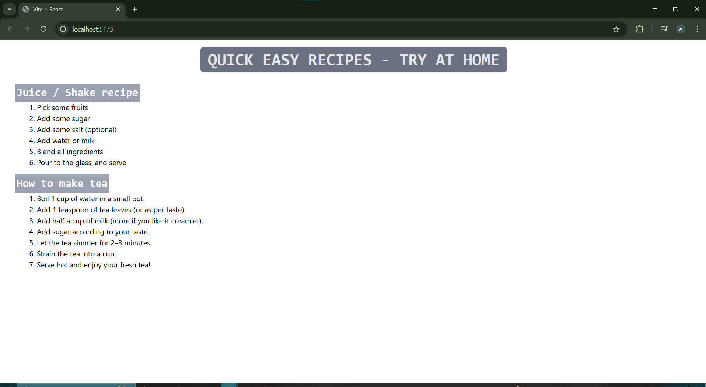

# 01_react_with_vite

This project is a React application created using Vite for fast development and build performance.

## Project's View in Browser  



## Key Features

- **Component-Based Structure:**  
  The project demonstrates how to define React components and import them into `App.jsx`. The `App` component is then imported and rendered in `main.jsx`.

- **Tailwind CSS Integration:**  
  Tailwind CSS is used for styling some components, allowing for rapid and utility-first UI development.

- **Modern Tooling:**  
  Built with Vite, which provides instant server start and lightning-fast hot module replacement.

## Getting Started

1. Install dependencies:
   ```
   npm install
   ```
2. Start the development server:
   ```
   npm run dev
   ```

## Learn More

- [React Documentation](https://react.dev/)
- [Vite Documentation](https://vitejs.dev/)
- [Tailwind CSS Documentation](https://tailwindcss.com/)
